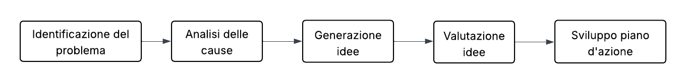

# Launching - Execution
Una volta definiti gli obiettivi, requisiti e le attività necessarie, il team è pronto per passare alla fase di lancio ed esecuzione del progetto.

## Kick-off Meeting
La fase di lancio del progetto inizia con il Kick-off Meeting, che ha l’obiettivo di allineare tutte le parti coinvolte sugli obiettivi, responsabilità, metodo di lavoro e aspettative operative. 
Questo incontro segna l’avvio ufficiale dell’esecuzione e contribuisce a stabilire una linea collaborativa, chiarezza e partecipazione attiva fin dall’inizio.

L'agenda del meeting è la seguente:
- Introduzione
- Presentazione del progetto da parte del committente
- Presentazione del progetto da parte del project manager
- Presentazione dei membri del team di progetto
- Illustrazione delle milestones del progetto, dell'approccio scelto (SCRUM) e dei deliverables attesi.
- Definizione delle regole operative del team
- Sessione di Q&A

## Matrice RASCI di assegnazione delle responsabilità
### Legenda 
- **(R) Responsible** -> Responsabile dell’attività e del suo completamento con
successo
- **(A) Accountable** -> Incaricato dell’approvazione del risultato dell’attività
- **(S) Support** -> Risorsa assegnata per supportare il responsabile
- **(C) Consulted** -> Disponibile per assistere il responsabile
- **(I) Informed** -> Membro che deve essere tenuto informato sullo stato di
avanzamento

Essendo un progetto universitario, Brini ha coperto due ruoli, il Project Manager e il componente del team di sviluppo.

|Attività| Brini   (Project Manager)| Brini   | Rattini | Samite |
|--------| --------------------------- | ------- | ------  | ------ |
|Studio e Formazione  | A | R | R | R |
|Avvio del progetto | R | I | I | I |
| Analisi di mercato | A | I | I | R |
| Configurazione setup | I | R | C | C |
| Frontend | A | I | R | S |
| Implementazione ciclo simulazione | A | R | C | C |
| Integrazione Prolog | A | I | I | R |
| Consegna progetto | R | I | I | I |

|Attività                           |  Brini   (Project Manager)  |  Brini |  Rattini  |  Samite|
|-----------------------------------|---------------------------|----------------|-----------|--------|
|Studio e Formazione                |  A                        |  R             |  R        |  R     |
|Avvio del progetto                 |  R                        |  I             |  I        |  I     |
|Analisi di mercato                 |  A                        |  I             |  I        |  R     |
|Configurazione setup               |  I                        |  R             |  C        |  C     |
|Frontend                           |  A                        |  I             |  R        |  S     |
|Implementazione ciclo simulazione  |  A                        |  R             |  C        |  C     |
|Integrazione Prolog                |  A                        |  I             |  I        |  R     |
|Comunicazione con stakeholder (simulato)     |  R              |  I             |  I        |  I     |
|Testing e validazione              |  A                        |  I             |  R        |  C     |
|Documentazione                     |  A                        |  I             |  C        |  R     |
|Consegna progetto                  |  R                        |  I             |  I        |  I     |

## Tools
- **Github** -> piattaforma centralizzata per la gestione del codice sorgente con repository, strumenti di Continuous Integration (CI), e GitHub Pages per ospitare la documentazione del progetto in modo accessibile e sempre aggiornato.
- **YouTrack** -> potente sistema di gestione di task, bug e milestone ottimizzato per metodologie Agile come SCRUM; permette di pianificare sprint, tracciare lo stato di avanzamento e generare report dettagliati.
- **Microsoft Teams** -> ambiente integrato per comunicazioni e meeting, con chat, videochiamate e condivisione di file che supportano la collaborazione in tempo reale tra i membri del team.
- **LucidChart** -> strumento versatile per la creazione di diagrammi e flowchart, ideale per realizzare rappresentazioni visuali di processi, flussi di lavoro, diagrammi di rete come il PND e documentazione tecnica.

## Regole operative per il team
Per garantire un corretto svolgimento delle attività e una comunicazione efficiente tra i membri del team, sono state definite le seguenti regole operative:

### Problem solving
Il team adotta un approccio strutturato al problem solving seguendo i 5 passi proposti da Daniel Couger, così da garantire collaborazione, trasparenza e rapidità nella risoluzione dei problemi.

1 - Definizione del problema -> Si chiarisce e si delimita il problema in modo preciso, descrivendo contesto, impatti e obiettivi della risoluzione

2 - Analisi delle cause problema -> Si indagano le possibili cause del problema utilizzando tecniche come diagrammi causa-effetto 

3 - Generazione di idee (brainstorming) -> Il team propone e discute tutte le soluzioni possibili senza giudizio, promuovendo la creatività e il coinvolgimento attivo di tutti.

4 - Valutazione e prioritizzazione delle idee -> Le idee generate vengono analizzate, valutate secondo criteri condivisi (costo, impatto, fattibilità) e si selezionano le più adatte.

5 - Sviluppo di un piano d'azione -> Si stabilisce la sequenza operativa delle soluzioni scelte.

### Decision making
Per la gestione delle decisioni, il team si impegna a seguire un approccio ***Participative/Collaborative***. Ogni membro del team partecipa al processo decisionale (decision-making). Tutte le decisioni prese vengono formalizzate e documentate in modo da avere coinvolgimento e trasparenza totale.

### Team meetings
Il team adotta il framework SCRUM bla bla bla
Tipologie di meeting:
- Daily Status Meetings (Daily SCRUM)
- Sprint Review (ogni fine sprint)
- Sprint Planning (ogni inizio sprint)

Dai Daily SCRUM meeting possono emergere problemi o necessità varie, che verranno risolte organizzando riunioni di problem solving o di supporto.

Il team adotta il framework SCRUM per la gestione agile del progetto, organizzando le attività in sprint bisettimanali e garantendo un ciclo di feedback continuo e iterativo.

Tipologie di meeting principali:
- *Daily Status Meetings (Daily SCRUM)*: brevi incontri giornalieri di circa 15 minuti, focalizzati sullo stato di avanzamento, eventuali impedimenti e piani per la giornata successiva. Questi meeting aiutano a mantenere il ritmo e la trasparenza nel team.

- *Sprint Review*: si svolge alla fine di ogni sprint per presentare i risultati ottenuti agli stakeholder e raccogliere feedback utili per i cicli successivi.

- *Sprint Planning*: incontro iniziale di ogni sprint in cui il team pianifica e definisce il lavoro da svolgere, stabilendo priorità e obiettivi condivisi.

Durante i Daily SCRUM possono emergere problemi tecnici, ostacoli organizzativi o richieste di supporto che non trovano risoluzione immediata. In questi casi, verranno organizzate specifiche sessioni di problem solving o riunioni di supporto, mirate a discutere e risolvere tali questioni senza impattare negativamente sul flusso di lavoro quotidiano.

## Gestione dei cambiamenti di scope

Nell'eventualità in cui emergessero nuove esigenze o risultasse necessario modificare l’ambito del progetto, il team applica una procedura strutturata che assicura trasparenza, tracciabilità e controllo su ogni variazione di scope.

Nel caso in cui si rendesse necessario apportare modifiche allo scope del progetto, il team adotta un processo strutturato per gestire i cambiamenti in modo efficace e trasparente il quale prevede le seguenti fasi:

1 - **Segnalazione della richiesta di cambiamento**: Chiunque nel team o tra gli stakeholder può proporre un cambiamento, parlando direttamente con il Project Manager. La richiesta deve includere una descrizione dettagliata della modifica, la motivazione e i benefici attesi.

2 - **Valutazione d’impatto:** Il Project Manager, insieme ai componenti del team di sviluppo interessati, effettua una rapida ma approfondita valutazione su: 
- Effetti sulla timeline
- Impatti su costi e risorse
- Benefici e rischi associati
- Deliverable o milestone coinvolte

3 - **Riunione di confronto**: Se la richiesta ha impatti rilevanti, viene convocato un meeting dedicato in cui si discutono le alternative e si definiscono eventuali adattamenti al piano lavori. 

4 - **Decisione formale:** Il Project Manager, raccolto il feedback e valutatane la fattibilità, comunica l’esito:

- Approvata: il cambiamento entra a backlog, le attività e il Gantt vengono aggiornati.

- Parzialmente approvata: la modifica viene accolta ma ridimensionata o pianificata per una fase successiva.

- Rifiutata: la richiesta viene respinta con motivazione.
