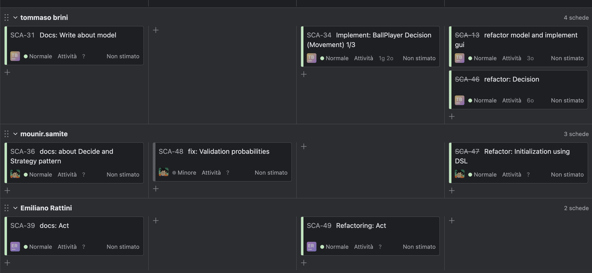

# Monitoring - Controlling
L'obiettivo di questa fase è controllare e monitorare sistematicamente l’avanzamento delle attività per verificare che tempi, costi e obiettivi siano rispettati. Attraverso il monitoraggio è possibile individuare tempestivamente eventuali scostamenti o criticità, intervenendo con azioni correttive per garantire la corretta realizzazione del progetto secondo quanto pianificato.

## Reporting
L'adozione del framework SCRUM garantisce al team un flusso costante di informazione grazie a riunioni settimanali strutturate e alla suddivisione degli obiettivi in sprint brevi e misurabili. Questo approccio agevola la trasparenza sull'avanzamento del progetto e il monitoraggio sistematico dei progressi.

Per il monitoring quotidiano, il team utilizza YouTrack, configurato con board SCRUM e campi su misura per priorità, stato, stime e assegnazioni. Qualsiasi attività, obiettivo o milestone viene tracciata in modo puntuale all'interno di uno sprint, consentendo di avere sempre il quadro aggiornato dei compiti in corso e delle responsabilità.

La scelta di YouTrack si basa sulla sua affidabilità, semplicità di utilizzo e diffusione tra i membri del gruppo, la maggior parte dei quali già lo impiegano in altri contesti progettuali

L'interfaccia, come illustrato nella figura sotto, permette di visualizzare i quattro principali stati dei ticket e di tenere sotto controllo l'allocazione delle attività ai diversi membri del team. I ticket eventualmente non completati nello sprint corrente vengono automaticamente ripianificati nello sprint successivo, garantendo una gestione agile dei backlog e delle priorità.

In questo modo il reporting diventa un processo continuo di allineamento, revisione e miglioramento.

## ISSUE LOG

Per la gestione strutturata delle problematiche e delle richieste emerse durante il progetto il team utilizza l'Issue Log integrato in YouTrack.

L'Issue Log è una lista di problemi o bug del progetto. Serve a tenere traccia delle problematiche aperte e delle decisioni e azioni prese per risolverle. Ogni issue rappresenta un elemento (bug, ostacolo, richiesta di chiarimento ecc..) e viene registrata con dettagli quali descrizioni, priorità, assegnatario e cronologie delle modifiche.

Le informazioni salvate per ogni issue sono:
  ● ID Number
  ● Date logged
  ● Descrizione del problema
  ● Descrizione dell’impatto sul progetto se non sarà risolto
  ● Definizione del “proprietario” del problema (problem owner)
  ● Azione che deve essere intrapresa per risolvere il problema
  ● Stato
  ● Esito

L’Issue Log è accessibile a tutti i membri del team, favorisce la trasparenza e viene consultato sia nei Daily che nelle sessioni di Sprint Review e retrospettiva. Il monitoraggio delle issue si estende su tutto il ciclo di vita del progetto, assicurando tempestività nella risoluzione e miglioramento continuo nel flusso di lavoro.

