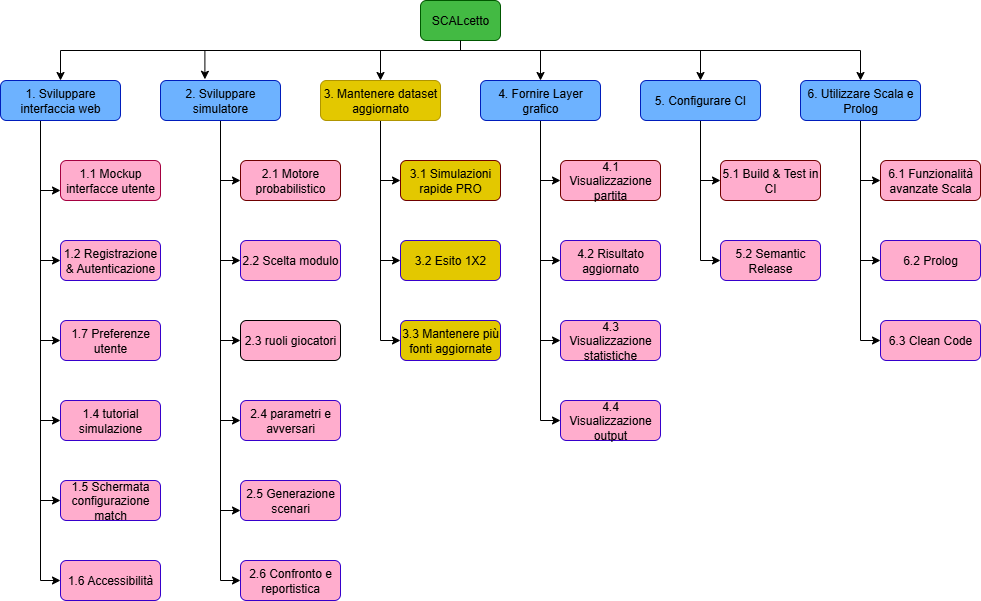

# Requirements Breakdown Structure (RBS)

A partire dagli obiettivi definiti nel POS, vengono esplosi i requisiti del sistema nel formato di una Requirements Breakdown Structure.

1. **Sviluppare un'interfaccia web facilmente utilizzabile, con focus su user experience.**
     1.1. Mockup delle interfacce utente
     1.2. Il sistema deve permettere di registrarsi e autenticarsi al sistema.
     1.3. Il sistema deve mantenere le informazioni sull'utente riguardo i propri interessi salvati (squadra preferita/modulo ecc..) 
     1.4. Tutorial guidato alla prima simulazione
     1.5. Schermata unica per selezione match, formazione, modulo e fattore campo.
     1.6. Accessibilità basilare
     1.7. Preferenze utente: salvataggio preset scenario e ultimo contesto aperto

2. **Sviluppare un simulatore che fornisca analisi del match con esito 1X2, configurando formazione e modulo.**
       2.1. Selezione competizione e match (Serie A/B)
       2.2. Configurazione formazione titolare e panchina
       2.3. Scelta del modulo tattico
       2.4. Parametri scenario aggiuntivi: fattore campo, forma recente, assenze chiave
       2.5. Motore probabilistico 1X2 con numero di run configurabile

3. **Mantenere dataset aggiornato settimanalmente, con periodo di forma e storico recente delle squadre.**
      3.1. Mantenere più fonti per squadre e formazioni

4. **Fornire un layer grafico per visualizzare la simulazione divertente e interattivo.**
      4.1. Componenti grafici per visualizzazione partita
      4.2. Risultato aggiornato in tempo reale a ogni goal.
      4.3. Sezione statistiche con possesso palla, corner, falli ecc...
      4.4. Componenti grafici per visualizzare i risultati della simulazione

5. **Organizzare e configurare i workspace con build tool adeguato e pipeline CI attiva.**
      5.1. Build e Test automatizzati in CI
      5.2. Semantic release a ogni push sul branch main

6. **Implementare il core in Scala in stile funzionale; integrare una componente Prolog**
      6.1. Approfondire e implementare funzionalità avanzate del linguaggio (monadi, mixin, ecc..)
      6.2. Integrare una parte in Prolog
      6.3. Clean code

