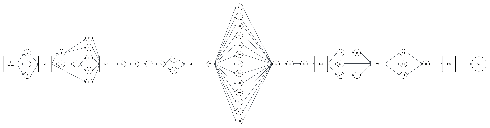

# Project Network Diagram

Il PND rappresenta in modo visivo la sequenza delle attività di progetto e le loro dipendenze logiche, organizzando i task individuati dalla WBS in una struttura che alimenta direttamente la schedulazione nel Gantt Chart.

Le attività sono modellate come nodi, mentre gli archi indicano le relazioni di precedenza tra i task.

Si adotta il metodo con le quattro relazioni standard (Finish-To-Start, Start-To-Start, Finish-To-Finish, Start-To-Finish) per definire al meglio i predecessori.

Vengono definite le milestone principali:
- M1: **Studio e formazione** -> Il team è a proprio agio con il linguaggio nuovo, in grado di sviluppare il progetto seguendo le linee guida principali per la programmazione funzionale avanzata in Scala. Verranno segnalati quali aspetti avanzati saranno impiegati nello sviluppo del progetto.
- M2: **Setup completo del progetto** -> ambienti e pipeline pronte per lavorare in sicurezza e in modo ripetibile. DVCS e policy PR attive, build/test automatizzati, coverage e quality gate, semantic release su main, commit convenzionali e documentazione operativa, CI attiva.
- M3: **Implementazione mockup e interfaccia grafica** -> Primo prototipo UI navigabile su cui validare UX e I/O della simulazione.
- M4: **Implementazione ciclo di controllo a step (sense-decide-act)** -> primo prototipo funzionante (dumb) del motore con flusso completo.
- M5: **Raffinato motore di simulazione** -> release tecnica con simulatore avanzato, metriche tattiche e test completi.
- M6: **Rilascio** -> consegna del progetto.

| Task ID | Description                      | Durata (Ore-Uomo)   | Predecessore|
| ------- | -------------------------------- | ------------------- | ----------- |
|    1    | Start                            |                     |             |
|    2    | Studio Scala                     |         12          |      1      |
|    3    | Studio Prolog                    |         12          |      1      |
|    4    | Studio programmazione funzionale |         16          |      1      |
|    M1   | **Studio e formazione**          |                     |             |
|    5    | Configurazione DVCS e repo       |         6           |      M1     |
|    7    | Configurazione build             |         2.5         |      M1     |
|    8    | Scelta gitflow                   |         2           |      5      |
|    9    | Configurazione workflow per build & test |  5          |      7      |
|    10   | Configurazione coverage          |        3.5          |      M1     |
|    11   | Configurazione githooks          |        2.5          |      9      |
|    12   | Configurazione release           |        2            |      9      |
|    13   | Configurazione badge README      |        1            |      5      |
|    M2   | **Setup completo**               |                     |             |
|    14   | Approfondimento sull'accessibilità |       4           |      M2     |
|    15   | Implementazione mockup           |         8           |      14     |
|    16   | Implementazione interfacce utente|         16          |      15     |
|    17   | Implementazione registrazione e autenticazione |   16  |      16     |
|    18   | Salvataggio preferenze utente    |           8         |      17     |
|    19   | Tutorial guidato alla prima simulazione |    9         |      17     |
|    M3   | **Implementazione mockup e interfaccia grafica**|      |             |
|    20   | Implementazione ciclo sense-decide-act |      16       |      M3     |
|    21   | Definizione e aggiunta moduli    |            1        |      20     |
|    22   | Definizione e aggiunta principi di gioco |    2        |      20     |
|    23   | Definizione ruoli giocatori      |           0.5       |      20     |
|    24   | Definizione stati di squadra     |           0.5       |      20     |
|    25   | Definizione situazioni di default |          2         |      20     |
|    26   | Definizione variazioni situazionali |        3         |      20     |
|    27   | Definizione marcature            |           3         |      20     |
|    28   | Definizione parametri di squadra |           3         |      20     |
|    29   | Definizione avversari            |           6         |      20     |
|    30   | Definizione condizioni esterne   |           7         |      20     |
|    31   | Definizione output               |           3         |      20     |
|    32   | Definizione heatmap squadra      |           2         |      20     |
|    33   | Definizione confronto tra moduli |           2         |      20     |
|    34   | Valutazione scelte per giocatore |         4.5         |    21-33    |
|    35   | Implementazione calcolo scelta a ogni step |   8       |      34     |
|    36   | Aggiornamento posizione giocatori e palla|   4         |      35     |
|    M4   | **Implementazione ciclo di controllo a step (sense-decide-act)** | | |
|    37   | Implementazione motore probabilistico |        12      |      M4     |
|    38   | Aggiunta variabili non deterministiche |       4       |      37     |
|    39   | Implementazione controlli play/pause/restart |   2.5   |      M4     |
|    40   | Aggiornamento stato punteggio e cronometro |      1    |      M4     |
|    41   | Visualizzare i risultati della simulazione |     5     |      40     |
|    M5   | **Raffinato motore di simulazione** |                  |             |
|    42   | Implementazione pannello statistiche live|     3       |      M5     |
|    43   | Fornire template di report |                2          |      M5     |
|    44   | Implementare export di risultati |          4          |      M5     |
|    45   | Scrivere relazione e linee guida |         40          |    42-43-44 |
|    M6   | **Rilascio**                      |                    |             |

