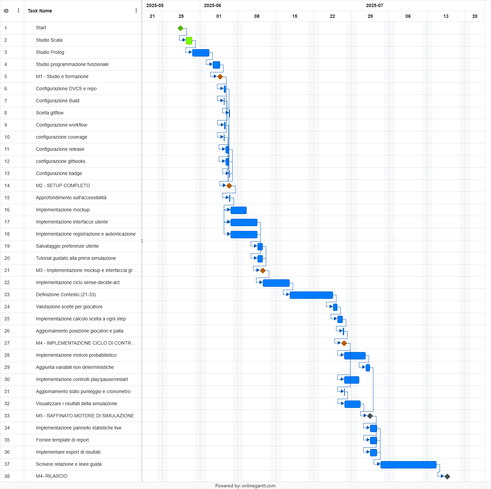
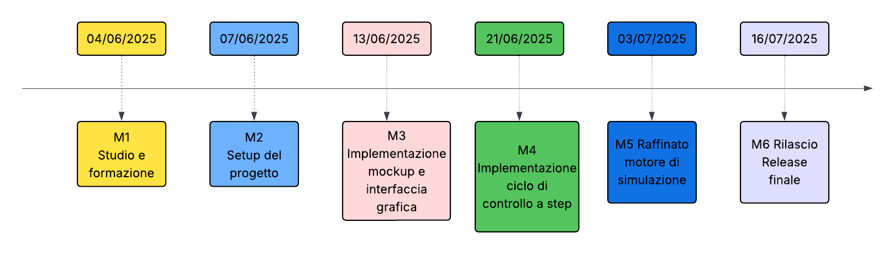

# Gantt Chart

Di seguito è riportato il Gantt del progetto, che visualizza le attività principali, le relative dipendenze temporali e le finestre previste per ciascuna fase di sviluppo.

La pianificazione deriva dal PND: ogni barra rappresenta un task WBS, mentre i legami mostrano l’ordine logico di esecuzione e gli eventuali parallelismi.

Tramite il Gantt, sono state evidenziate le milestone M1–M6, utilizzate come punti di controllo a durata zero per scandire l’avanzamento del progetto e evidenziare le principali release intermedie.

La fine del progetto è prevista il 17 Luglio 2025, giorno in cui l'applicativo dovrà essere consegnato per la valutazione d'esame, in linea con le [Conditions of Satisfactions](../allegati/03-CoS.md) 

